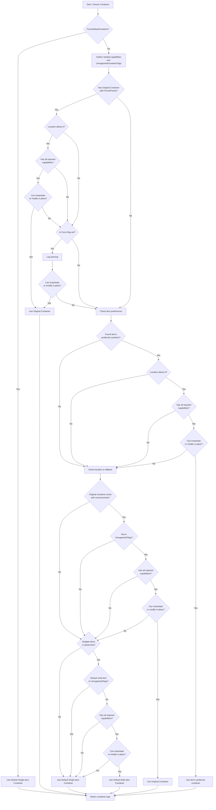

# Container Selection Process

The `ContainerLocation.ChooseBestContainerType()` method determines which container implementation should be used for a
location based on placement context, item preferences, and requested container capabilities. This article outlines the
container selection process in visual form.

## Key Concepts

**Container Support**: The location's `Supports()` method and `ForceDefaultContainer` flag determine whether a container
type is allowed at this location. Additionally, `UnsupportedContainerTag`s attached to the location or placement will
disallow the specified container types at the location.

**Required Capabilities**: Containers may need to support specific capabilities (e.g., paying costs). The selection
process validates that chosen containers can fulfill all capabilities required by the placement's items and tags.

**Instantiate vs. Modify**: The selection process consistently checks whether a container can instantiate (create new
instances) or only modify existing containers in place. If the original container is under consideration, the location
may support in-place modification or instantiation. For replacement containers, they must support instantiation. This
check appears at every decision point where a container is considered.

## Selection Flow

